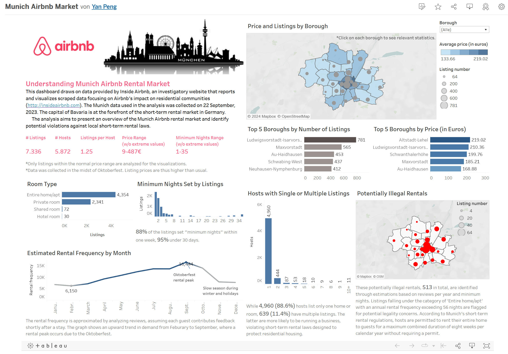

### AirbnbDashboard
In this personal project, I utilized data on the Munich Airbnb rental market to create a Tableau dashboard.
### Project Objective
The capital of Bavaria is at the forefront of the short-term rental market in Germany. The dashboard presents an overview of the Munich Airbnb rental market, identifying potential violations against local short-term rental laws.
### Key Insights
The following are the key insights drawn from the data (note that listings with unusual prices are not included):
- The most common room types are "Entire home/apartment" and "Private room", with the former occurring 1.86 times more frequently than the latter.
- 88% of the listings set "minimun nights" within one week, 95% under 30 days.
- Boroughs with the highest number of listings and prices are located in or near the city center.
- 11.4% of the hosts have multiple listings, who are more likely to be running a business and violating short-term rental laws.
- The estimated rental frequency by month shows an upward trend in demand from February to September, where a rental peak occurs due to the Oktoberfest.
- 513 listings are identified as potentially ilegal rentals, which are entire homes or apartments with an estimated annual rental frequency exceeding 56 nights (8 weeks are the maximum duration according to local regulations).
### Data
The data is provided by the investigatory website [Inside Airbnb](http://insideairbnb.com). The Munich data used in the analysis was collected on 22 September, 2023.
### Tableau Link
[Here](https://public.tableau.com/app/profile/yan.peng5682/viz/AirbnbMunichAnalysis/AirbnbMunichAnalysis) is the link to the Tableau dashboard.

